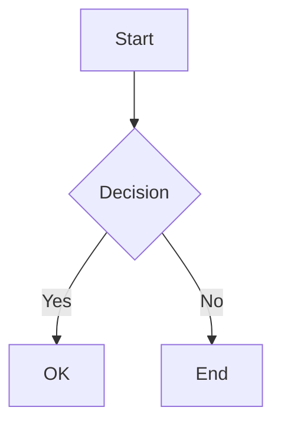

# md2pdf-mermaid

[](https://github.com/shakoorhussain/md2pdf-mermaid/actions/workflows/ci.yml)
[](https://www.npmjs.com/package/md2pdf-mermaid)
[](https://opensource.org/licenses/MIT)

> Convert Markdown files with Mermaid diagrams to beautiful PDFs

A production-ready CLI tool and Node.js library for converting Markdown documents containing Mermaid diagrams to PDF. Supports Azure DevOps wiki syntax, code fencing, custom styling, and batch processing.

## ✨ Features

- 📄 **Mermaid Support** - Renders flowcharts, sequence diagrams, class diagrams, and more
- 🎨 **Custom Styling** - Apply custom CSS, themes, and highlighting
- 📦 **Batch Processing** - Convert multiple files at once
- 👀 **Watch Mode** - Auto-convert on file changes
- ⚙️ **Configurable** - JSON/JS config files for project settings
- 📝 **Multiple Syntaxes** - Supports both ` ```mermaid ` and `:::mermaid` formats
- 🔧 **Programmatic API** - Use as a library in your Node.js projects

## 📦 Installation

### Global (CLI)

```bash
npm install -g md2pdf-mermaid
```

### Local (Library)

```bash
npm install md2pdf-mermaid
```

## 🚀 Quick Start

### CLI Usage

```bash
# Convert a single file
md2pdf convert document.md

# Specify output path
md2pdf convert document.md -o output.pdf

# With options
md2pdf convert document.md --format Letter --theme forest --landscape

# Batch convert
md2pdf batch "docs/**/*.md" --output-dir ./pdfs

# Watch mode
md2pdf watch "docs/**/*.md" --output-dir ./pdfs
```

### Programmatic Usage

```typescript
import { convertMarkdownToPdf, createConverter } from 'md2pdf-mermaid';

// Simple conversion
await convertMarkdownToPdf('document.md');

// With options
await convertMarkdownToPdf('document.md', 'output.pdf', {
  pdf: {
    format: 'A4',
    landscape: false,
    margin: { top: '20mm', bottom: '20mm', left: '15mm', right: '15mm' },
  },
  mermaid: {
    theme: 'forest',
    backgroundColor: 'transparent',
  },
});

// Using the Converter class for batch operations
const converter = createConverter({
  pdf: { format: 'Letter' },
  mermaid: { theme: 'dark' },
});

// Batch convert
const result = await converter.batchConvert({
  patterns: ['docs/**/*.md'],
  outputDir: './pdfs',
  concurrency: 3,
});

console.log(`Converted ${result.successful} files`);
```

## 📖 CLI Commands

### `convert` (alias: `c`)

Convert a single markdown file to PDF.

```bash
md2pdf convert <input> [options]
```

**Options:**

| Option | Description | Default |
|--------|-------------|---------|
| `-o, --output <path>` | Output PDF path | Same as input with .pdf |
| `-f, --format <format>` | Page format (A4, Letter, etc.) | A4 |
| `--landscape` | Landscape orientation | false |
| `--margin-top <size>` | Top margin | 20mm |
| `--margin-bottom <size>` | Bottom margin | 20mm |
| `--margin-left <size>` | Left margin | 15mm |
| `--margin-right <size>` | Right margin | 15mm |
| `--theme <theme>` | Mermaid theme | default |
| `--css <path>` | Custom CSS file | - |
| `-c, --config <path>` | Config file path | auto-detected |
| `--keep-intermediate` | Keep temp files | false |
| `-v, --verbose` | Verbose output | false |

### `batch` (alias: `b`)

Convert multiple markdown files.

```bash
md2pdf batch <patterns...> [options]
```

**Options:**

| Option | Description | Default |
|--------|-------------|---------|
| `-o, --output-dir <dir>` | Output directory | Same as input |
| `--concurrency <num>` | Max parallel conversions | 3 |
| `--continue-on-error` | Continue if some fail | false |
| `-f, --format <format>` | Page format | A4 |
| `--theme <theme>` | Mermaid theme | default |
| `-c, --config <path>` | Config file path | auto-detected |
| `-v, --verbose` | Verbose output | false |

### `watch` (alias: `w`)

Watch files and auto-convert on changes.

```bash
md2pdf watch <patterns...> [options]
```

**Options:**

| Option | Description | Default |
|--------|-------------|---------|
| `-o, --output-dir <dir>` | Output directory | Same as input |
| `-d, --debounce <ms>` | Debounce delay | 500 |
| `-f, --format <format>` | Page format | A4 |
| `--theme <theme>` | Mermaid theme | default |
| `-c, --config <path>` | Config file path | auto-detected |
| `-v, --verbose` | Verbose output | false |

### `init`

Create a default configuration file.

```bash
md2pdf init [options]
```

**Options:**

| Option | Description | Default |
|--------|-------------|---------|
| `-d, --dir <path>` | Directory for config | . |

## ⚙️ Configuration

Create a `md2pdf.config.json` file in your project root:

```json
{
  "pdf": {
    "format": "A4",
    "margin": {
      "top": "20mm",
      "right": "15mm",
      "bottom": "20mm",
      "left": "15mm"
    },
    "printBackground": true,
    "landscape": false
  },
  "mermaid": {
    "theme": "default",
    "backgroundColor": "transparent",
    "width": 800,
    "outputFormat": "png"
  },
  "style": {
    "highlightTheme": "github"
  }
}
```

Config file locations (searched in order):

1. Path specified with `--config`
2. `md2pdf.config.json`
3. `md2pdf.config.js`
4. `.md2pdfrc`
5. `.md2pdfrc.json`

## 🎨 Mermaid Diagram Support

Supports both common Mermaid syntax formats:

**Standard Markdown code fence:**

````markdown

````

**Azure DevOps / Wiki format:**

```markdown
:::mermaid
sequenceDiagram
    Alice->>Bob: Hello Bob
    Bob-->>Alice: Hi Alice
:::
```

### Supported Diagram Types

- ✅ Flowcharts
- ✅ Sequence diagrams
- ✅ Class diagrams
- ✅ State diagrams
- ✅ Entity Relationship diagrams
- ✅ Gantt charts
- ✅ Pie charts
- ✅ Git graphs
- ✅ And more...

## 🎨 Custom Styling

### Using a CSS file

```bash
md2pdf convert document.md --css custom.css
```

### CSS in config

```json
{
  "style": {
    "cssFile": "./styles/custom.css",
    "highlightTheme": "monokai"
  }
}
```

### Programmatic styling

```typescript
await convertMarkdownToPdf('doc.md', 'out.pdf', {
  style: {
    css: `
      body { font-family: 'Georgia', serif; }
      h1 { color: navy; }
      img { border: 1px solid #ddd; }
    `,
    highlightTheme: 'github-dark',
  },
});
```

## 📄 Page Formats

Supported formats: `A0`, `A1`, `A2`, `A3`, `A4`, `A5`, `A6`, `Letter`, `Legal`, `Tabloid`, `Ledger`

## 🎭 Mermaid Themes

Available themes: `default`, `forest`, `dark`, `neutral`, `base`

## 🔧 API Reference

### `convertMarkdownToPdf(input, output?, options?)`

Convert a single file.

```typescript
const result = await convertMarkdownToPdf('input.md', 'output.pdf', {
  pdf: { format: 'A4' },
  mermaid: { theme: 'forest' },
});

if (result.success) {
  console.log(`Created: ${result.outputFile}`);
}
```

### `createConverter(options?)`

Create a reusable converter instance.

```typescript
const converter = createConverter({
  verbose: true,
  pdf: { format: 'Letter' },
});

// Convert single file
await converter.convert('doc.md');

// Batch convert
await converter.batchConvert({ patterns: ['**/*.md'] });

// Watch mode
const watcher = converter.watch({ patterns: ['**/*.md'] });
// Later: await watcher.close();
```

### `createMermaidProcessor(options?)`

Create a Mermaid processor for custom pipelines.

```typescript
const processor = createMermaidProcessor({ theme: 'dark' });
const diagrams = processor.extractDiagrams(markdownContent);
await processor.processMarkdown(content, outputDir, baseName);
```

## 🐛 Troubleshooting

### Diagrams not rendering

- Ensure you have a recent version of Node.js (18+)
- Check Mermaid syntax for errors
- Try running with `--verbose` for detailed logs

### Puppeteer issues on Linux

Install required dependencies:

```bash
sudo apt-get install -y libgbm-dev gconf-service libasound2 libatk1.0-0 libc6 libcairo2 libcups2 libdbus-1-3 libexpat1 libfontconfig1 libgcc1 libgconf-2-4 libgdk-pixbuf2.0-0 libglib2.0-0 libgtk-3-0 libnspr4 libpango-1.0-0 libpangocairo-1.0-0 libstdc++6 libx11-6 libx11-xcb1 libxcb1 libxcomposite1 libxcursor1 libxdamage1 libxext6 libxfixes3 libxi6 libxrandr2 libxrender1 libxss1 libxtst6 ca-certificates fonts-liberation libappindicator1 libnss3 lsb-release xdg-utils wget
```

### Memory issues with large files

- Process files individually instead of batch
- Reduce concurrency with `--concurrency 1`
- Close other applications to free memory

## 📜 License

MIT © [Shakoor Hussain](https://github.com/shakoorhussain)

## 🤝 Contributing

Contributions are welcome! Please read our [Contributing Guide](CONTRIBUTING.md) for details.

1. Fork the repository
2. Create your feature branch (`git checkout -b feature/amazing`)
3. Commit your changes (`git commit -m 'Add amazing feature'`)
4. Push to the branch (`git push origin feature/amazing`)
5. Open a Pull Request

## 📣 Acknowledgements

- [mermaid-cli](https://github.com/mermaid-js/mermaid-cli) - Mermaid diagram rendering
- [md-to-pdf](https://github.com/simonhaenisch/md-to-pdf) - Markdown to PDF conversion
- [Puppeteer](https://pptr.dev/) - Headless Chrome for rendering
