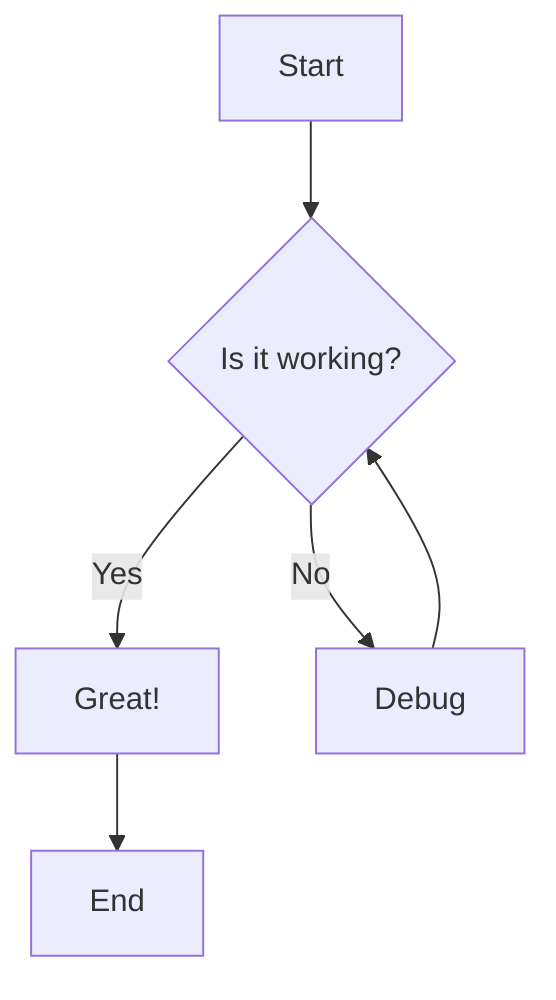
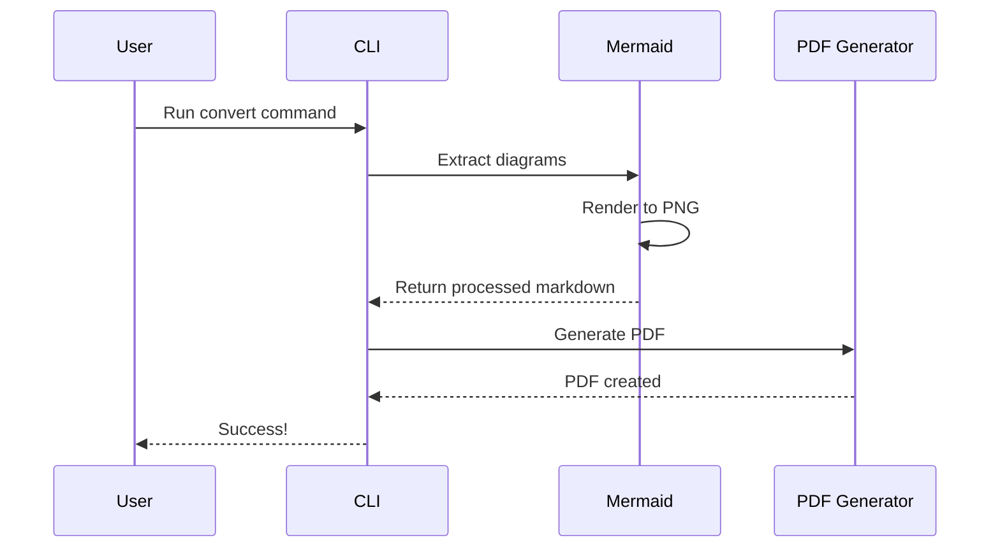
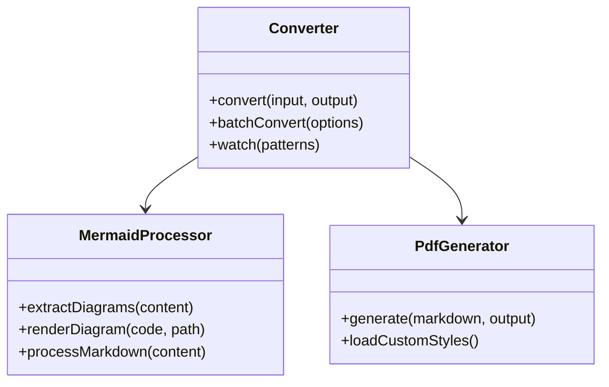

# Sample Document with Mermaid Diagrams

This is a sample markdown document demonstrating the md2pdf-mermaid converter.

## Flowchart Example



## Sequence Diagram



## Class Diagram



## Code Example

Here's some TypeScript code:

```typescript
import { convertMarkdownToPdf } from 'md2pdf-mermaid';

async function main() {
  const result = await convertMarkdownToPdf('document.md', 'output.pdf', {
    pdf: { format: 'A4' },
    mermaid: { theme: 'forest' },
  });
  
  console.log(`Success: ${result.success}`);
}

main();
```

## Table Example

| Feature | Status |
|---------|--------|
| Flowcharts | ✅ |
| Sequence Diagrams | ✅ |
| Class Diagrams | ✅ |
| Custom CSS | ✅ |
| Watch Mode | ✅ |

## Conclusion

This document demonstrates the capabilities of md2pdf-mermaid for converting markdown with diagrams to PDF.
